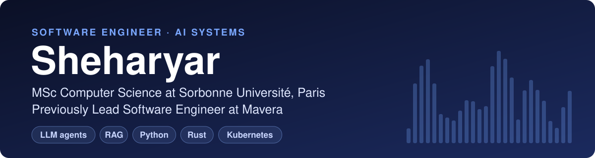
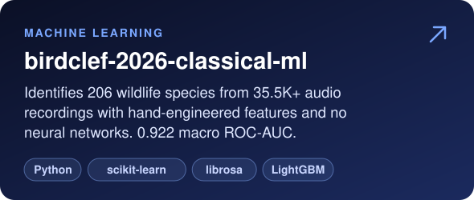
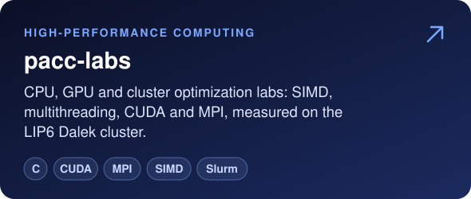
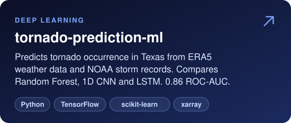
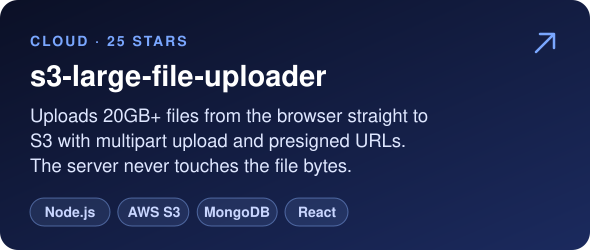
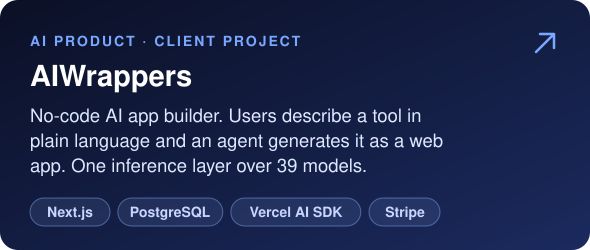
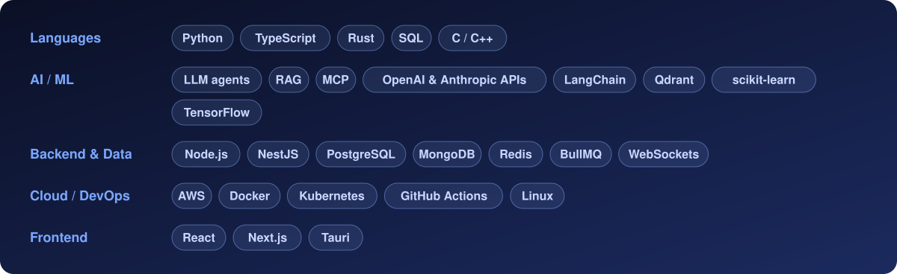

  <b>Open to a 6-month end-of-studies internship in Paris, starting February 2027.</b> 
  <a href="https://www.linkedin.com/in/sheharyar-ishfaq">LinkedIn</a> ·
  <a href="https://medium.com/@sheharyarishfaq">Medium</a>

## About

I build backend and AI systems: LLM agents, RAG pipelines and the infrastructure they run on.

At [Mavera](https://mavera.io), an AI market-intelligence platform used by 120+ companies, I built the web platform end to end, led the developers who joined later, and co-built the desktop agent in Rust and Tauri. I also ran its services on AWS and Kubernetes. Before that I worked on a research-writing platform in Finland and an operations system for a restaurant group in Dubai, alongside several years of freelance work.

I'm now in the final year of an MSc in Computer Science at Sorbonne Université, where the coursework is GPU programming with CUDA, cluster computing with MPI, and deep learning.

## Selected work

  
  

  
  

  
  

## Tech stack

## Writing

| Article | About |
| --- | --- |
| [Handling Large File Uploads (20GB+) in Node.js with S3 Multipart Upload](https://medium.com/@sheharyarishfaq/handling-large-file-uploads-20gb-in-node-js-with-s3-multipart-upload-using-signed-urls-b5e41c1cd930) | Chunked uploads straight from the browser to S3 with presigned URLs |
| [How to Deploy a Next.js App on AWS EC2 with Nginx and HTTPS](https://medium.com/@sheharyarishfaq/how-to-deploy-a-next-js-app-on-aws-ec2-with-nginx-and-https-step-by-step-guide-7024f5426c03) | Step-by-step deployment behind Nginx with HTTPS |
| [Subdomain-Based Routing in Next.js for Multi-Tenant Applications](https://medium.com/@sheharyarishfaq/subdomain-based-routing-in-next-js-a-complete-guide-for-multi-tenant-applications-1576244e799a) | One app serving each customer on its own subdomain with middleware |
